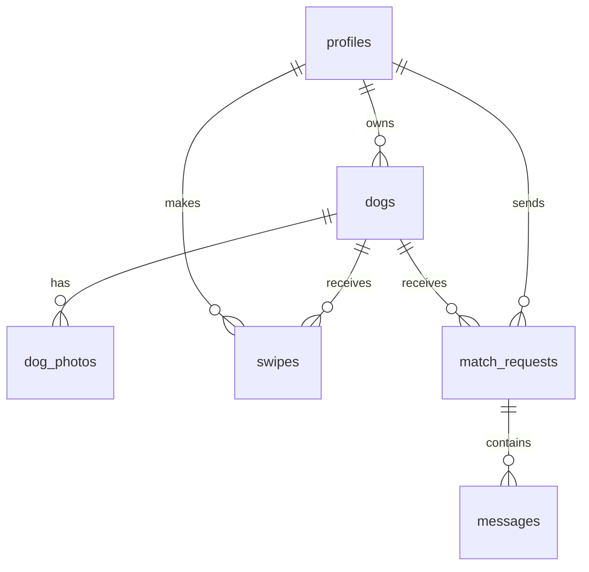
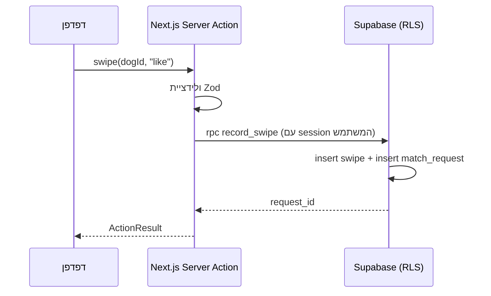

# TinDog — מסמך תכנון טכני

## סטאק טכנולוגי

- **Next.js 16 (App Router) + TypeScript** — צד לקוח וצד שרת באותו פרויקט
- **Tailwind CSS 4 + shadcn/ui** — עיצוב
- **Supabase** — PostgreSQL, Auth, Storage (תמונות), Realtime (צ'אט)
- **Zod** — ולידציית קלטים בצד השרת
- **Vercel** — Deployment
- **Vitest + React Testing Library + Playwright** — בדיקות

## מבנה התיקיות

```
pawmatch/
├── docs/                      # מסמכי הקורס
├── e2e/                       # בדיקות Playwright
├── scripts/seed.mjs           # יצירת נתוני דמו
├── supabase/migrations/       # סכמת הדאטהבייס (SQL)
├── src/
│   ├── app/                   # ה-pages (App Router)
│   │   ├── page.tsx           # דף נחיתה
│   │   ├── (auth)/            # login, signup
│   │   ├── (app)/             # אזור מחובר: swipe, dogs, requests, matches, profile
│   │   └── auth/callback/     # אישור אימייל
│   ├── actions/               # Server Actions (auth, dogs, swipes, requests, messages)
│   ├── components/            # קומפוננטות React
│   │   ├── ui/                # shadcn/ui
│   │   ├── swipe/             # SwipeDeck, DogCard, DeckFilters
│   │   ├── dogs/              # DogForm, PhotoUploader, DeleteDogButton
│   │   ├── requests/          # RequestCard
│   │   ├── chat/              # ChatRoom
│   │   └── auth/              # LoginForm, SignupForm, FormError
│   ├── lib/
│   │   ├── supabase/          # שלושה clients: browser, server, middleware
│   │   ├── validation.ts      # כל סכמות ה-Zod
│   │   ├── deck.ts            # לוגיקת חפיסה טהורה (ניתנת לבדיקה)
│   │   ├── constants.ts       # enums וקבועים
│   │   └── types.ts           # טיפוסי הדאטהבייס
│   └── proxy.ts               # הגנת ראוטים ורענון session
└── ...configs
```

## מבנה בסיס הנתונים



| טבלה | תפקיד | שדות מרכזיים |
|---|---|---|
| `profiles` | פרופיל משתמש (1:1 עם auth.users) | display_name, city, bio |
| `dogs` | פרופיל כלב | owner_id, name, age_years, size, energy_level, temperament, special_needs, **listing_type** (adoption/foster/playdate), city, is_active |
| `dog_photos` | תמונות (הקבצים ב-Storage) | dog_id, storage_path, sort_order |
| `swipes` | כל החלקה, ייחודי לכל (משתמש, כלב) | swiper_id, dog_id, direction |
| `match_requests` | בקשת התאמה מהחלקה ימינה | dog_id, requester_id, status (pending/approved/declined) |
| `messages` | הודעות צ'אט | request_id, sender_id, content |

**החלטת מודל מרכזית**: `listing_type` על הכלב מאחד את שני מקרי השימוש (אימוץ/אומנה ופלייטדייט) תחת זרימה אחת — החלקה ← בקשה ← אישור ← צ'אט. אין צורך בשתי מערכות נפרדות.

טריגרים: `handle_new_user` יוצר שורת profile אוטומטית בהרשמה; `touch_updated_at` מעדכן זמן שינוי סטטוס בקשה.

## פעולות CRUD מרכזיות

| ישות | Create | Read | Update | Delete |
|---|---|---|---|---|
| profiles | טריגר בהרשמה | כל מחובר | הבעלים בלבד | cascade מ-auth |
| dogs | `createDog` | חפיסה / הבעלים | `updateDog` (בעלים) | `deleteDog` (בעלים, כולל תמונות) |
| swipes | `swipe` (RPC אטומי) | הבעלים בלבד | — | — |
| match_requests | אוטומטי בהחלקה ימינה | שני הצדדים | `decideRequest` (בעל הכלב) | — |
| messages | `sendMessage` | משתתפי בקשה מאושרת | — | — |

## תיאור ה-API (Server Actions)

כל הכתיבות עוברות דרך Server Actions — אין REST endpoints ידניים. כל action: מוודא קלט עם Zod ← יוצר Supabase client עם ה-session מה-cookies ← מבצע שאילתה שכפופה ל-RLS ← מחזיר `ActionResult`.

| Action | קובץ | תפקיד |
|---|---|---|
| `signup`, `login`, `logout`, `updateProfile` | `actions/auth.ts` | ניהול חשבון |
| `createDog`, `updateDog`, `deleteDog` | `actions/dogs.ts` | ניהול כלבים |
| `getDeck`, `swipe` | `actions/swipes.ts` | חפיסה והחלקות |
| `decideRequest` | `actions/requests.ts` | אישור/דחיית בקשה |
| `sendMessage` | `actions/messages.ts` | שליחת הודעה |

שתי פונקציות PostgreSQL (RPC) משלימות:

- `get_swipe_deck(listing_type, city, limit)` — מחזירה את הכלבים הבאים: פעילים, לא שלי, שלא הוחלקו, עם תמונות ושם בעלים, בשאילתה אחת יעילה.
- `record_swipe(dog_id, direction)` — רושמת החלקה ויוצרת בקשת התאמה **באותה טרנזקציה** (אטומיות).

## זרימת המידע



הצ'אט הוא היוצא מהכלל: הודעות חדשות מגיעות ישירות מ-Supabase Realtime לדפדפן (subscription על INSERT בטבלת messages, מסונן לפי request_id), כך שאין polling.

## עמודים

| ראוט | תפקיד | גישה |
|---|---|---|
| `/` | דף נחיתה | ציבורי |
| `/login`, `/signup` | הזדהות | ציבורי |
| `/swipe` | חפיסת ההחלקה + סינון | מחובר |
| `/dogs`, `/dogs/new`, `/dogs/[id]/edit` | ניהול הכלבים שלי | מחובר (בעלים) |
| `/requests` | בקשות נכנסות לאישור | מחובר (בעל הכלב) |
| `/matches`, `/matches/[id]` | התאמות וצ'אט | מחובר (משתתף) |
| `/profile` | הפרופיל שלי | מחובר |

## ניהול State

- **State שרת** — נטען ב-Server Components (רשימות כלבים, בקשות, התאמות). `revalidatePath` מרענן אחרי כתיבות.
- **State לקוח מקומי** — רק היכן שנדרש אינטראקטיביות: חפיסת ההחלקה (`useState` + `useTransition`), טפסים (`useActionState`), צ'אט (state + Realtime subscription).
- אין ספריית state גלובלית — אין בה צורך בארכיטקטורה הזו.

## טיפול בשגיאות

- כל Server Action מחזיר `ActionResult = { ok: true } | { ok: false, error }` — אין exceptions שדולפים ללקוח.
- הודעות שגיאה ידידותיות מוצגות ליד הטופס/הפעולה (`role="alert"`).
- כשלים "שקטים" (למשל refill של החפיסה) מציגים הודעה לא חוסמת.
- דפים שמבקשים ישות לא קיימת/לא מורשית מקבלים `notFound()` (404).

## ולידציות

שלוש שכבות:

1. **דפדפן** — `required`, `type`, `min/max` על שדות הטופס + בדיקת גודל/סוג קובץ לפני העלאה.
2. **שרת (Zod)** — כל קלט נבדק ב-Server Action; הודעת השגיאה הראשונה מוחזרת לתצוגה.
3. **דאטהבייס** — CHECK constraints (טווח גיל, ערכי enum, אורכי טקסט), UNIQUE constraints, FK.

## חוויית המשתמש המרכזית

- חפיסת קלפים עם גרירה פיזית (pointer events): הקלף מסתובב עם הגרירה, חותמות LIKE/PASS מופיעות בהדרגה, וכפתורי לב/X למי שמעדיף קליק. תמיכה גם בחיצי מקלדת.
- קרוסלת תמונות בתוך הקלף (הקשה על צד ימין/שמאל).
- Badge עם מספר הבקשות הממתינות בניווט — בעל הכלב לא מפספס פניות.
- צ'אט עם בועות, גלילה אוטומטית ועדכון בזמן אמת.
- ריספונסיבי — מובייל תחילה (זו אפליקציית swipe).
